# The Mythology Quiz
[View the live project here.](https://emilija-smitaite.github.io/the-mythology-quiz/)

This is a mythology themed quiz game. The game contains 5 multiple choice questions with results calculated at the end. The website is easy to use and responsive.

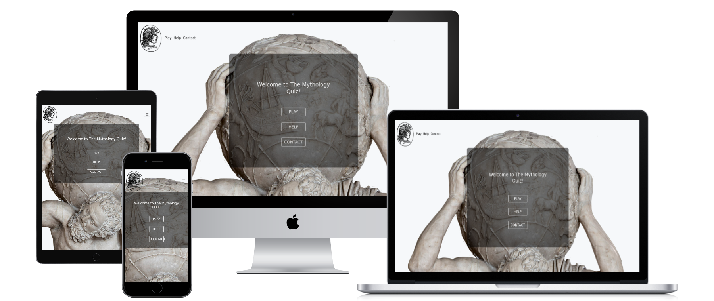

# User Experience (UX)
## User stories

   #### **First time visitor goals**
   1. As a First Time Visitor, I want to immediately identify the main purpose of the website.
   2. As a First Time Visitor, I want to easily navigate through the website.
   3. As a First Time Visitor, I want to see Help / How to play section on the home page.
   4. As a First Time Visitor, I want the website's colour scheme and general feel to reflect the theme of the quiz.
   5. As a First Time Visitor, I want to have fun playing.
   6. As a First Time Visitor, I want to see my score.

   #### **Returning Visitor Goals**
   1. As a Returning Visitor, I want to improve my score.
   2. As a Returning Visitor, I want to be able to leave feedback and be assured it has been delivered.

   #### **Frequent User Goals**
   1. As a Frequent User, I want to replay the quiz and keep learning on the subject.

## Design

  #### **Colour scheme**
  - Minimal palette consisting of shades of black and white. These colours are used to help the background image to stand out.
  #### **Typography**
  - All the elements use Bootstrap native font stack which adapts to the device. These fonts are familiar to the user, professional and clean looking, a good match to this project where style focus is on the background image.
  #### **Imagery**
  - Large, background hero image is in line with the theme of the quiz. Both background image and home icon represent antiquity legends and they have an elegant feel to it. I have downloaded background image form [ImgBin](https://imgbin.com/png/RBf9Q0JR/medusa-greek-mythology-png), home icon from [Hiclipart](https://imgbin.com/png/RBf9Q0JR/medusa-greek-mythology-png).

## Wireframes
- Mobile Home page and iPad Game page  
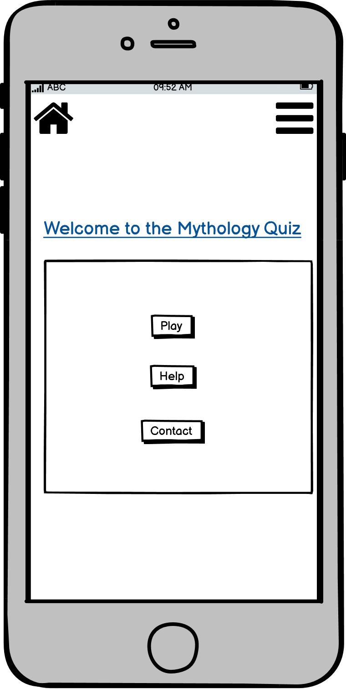 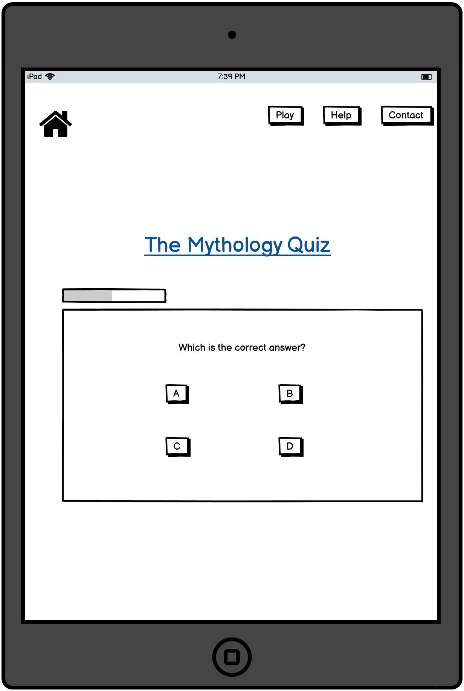  
- Desktop results page
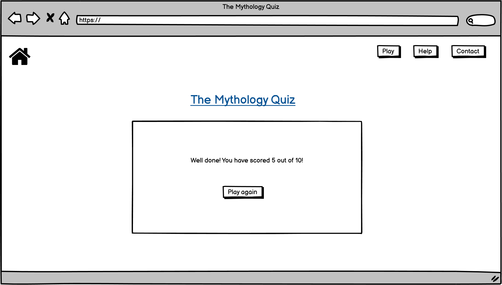

## Features
* Responsive on all device sizes
* Intuitive and easy to use.

# Further development
* Next step in the development would be challenging other players, implementing scoreboard.

# Technologies Used
## Languages Used
   - HTML
   - CSS
   - JavaScript

## Frameworks, Libraries & Programs Used
1. Open Trivia API used for quiz questions.
 https://opentdb.com/api.php?amount=10&category=20&type=multiple
2. Git:
- Git was used for version control by utilizing the Gitpod terminal to commit to Git and Push to GitHub.
3. GitHub:
- GitHub is used to store the project's code after being pushed from Git.
4. Balsamiq:
- Balsamiq was used to create the wireframes during the design process.
5. Bootstrap 5.1.3:
- Bootstrap was used to assist with the responsiveness and styling of the website.
6. Font Awesome:
- Font Awesome was used to style icons in the quiz outcome paragraph.
7. Favicon.io
- Used to convert png format into ico format.
8. Web Formatter:
- Web Formatter was used to add proper indentation and improve readability on HTML, CSS and JS files.

# Testing

## Testing User Stories from User Experience (UX) Section

#### **First time visitor goals**
1. As a First Time Visitor, I want to immediately identify the main purpose of the website.
* Upon entering the site, users are greeted with the main heading. 
* Background image and home link at the top left corner support the main heading.
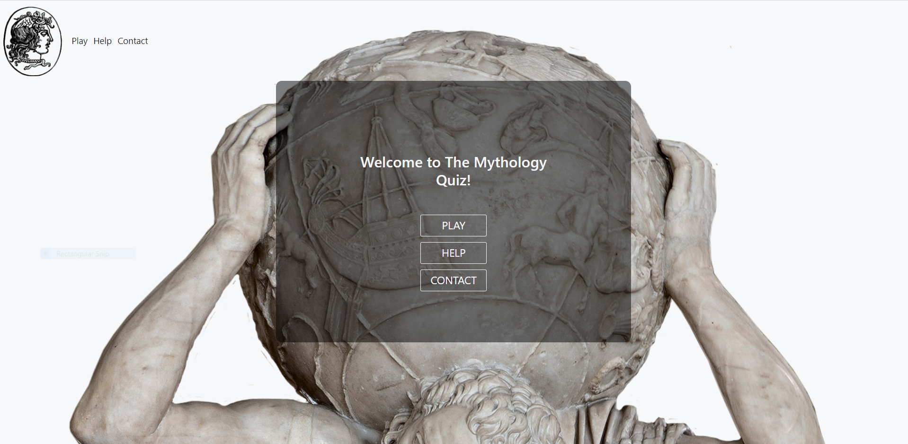
2. As a First Time Visitor, I want to easily navigate through the website.
* Navbar and main section of index.html both offer easy navigation from anywhere in the site.
* Game can be restarted at any point.
3. As a First Time Visitor, I want to see Help / How to play section on the home page.
* Immediately visible in the navbar and the main section of the index.html.
4. As a First Time Visitor, I want the website's colour scheme and general feel to reflect the theme of the quiz.
* Background image is an antiquity period marble sculpture of Atlas holding The World on his shoulders.
Home button has an image of The Medusa. Both are quite well-known legends.
5. As a First Time Visitor, I want to have fun playing.
* The game is inviting, quick to play, has got interesting questions.
6. As a First Time Visitor, I want to see my score progress.
* Scores are updated as it goes.
7. As a First Time Visitor, I want to game controls to be intuitive.
* On picking an answer, the next question is shown automatically.
* Once the last question has been answered, the result is displayed, PLAY AGAIN button shows up.

#### **Returning Visitor Goals**
1. As a Returning Visitor, I want to improve my score.
* Score is displayed at the end of the game and during the game.
2. As a Returning Visitor, I want to be able to leave feedback and be assured it has been delivered.
 
#### **Frequent User Goals**
1. As a Frequent User, I want to replay the quiz and keep learning on the subject.
* In case of an incorrect answer, the correct one is displayed.
* At the end of the game, the PLAY AGAIN button is shown.
* Play link at the nav bar has the same functionality as the PLAY AGAIN button.   

### The W3C Markup Validator and W3C CSS Validator Services were used to validate every page of the project to ensure there were no syntax errors in the project.
 * HTML validator results 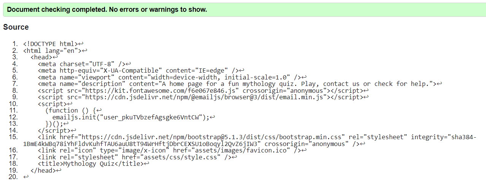 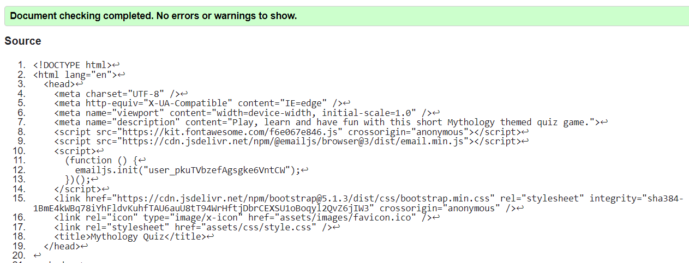 
 * CSS validator results 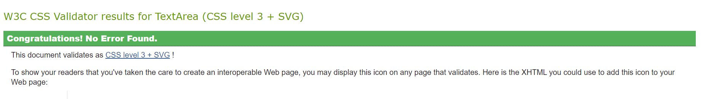

### Lighthouse was used to measure performance.
* Lighthouse report for desktop 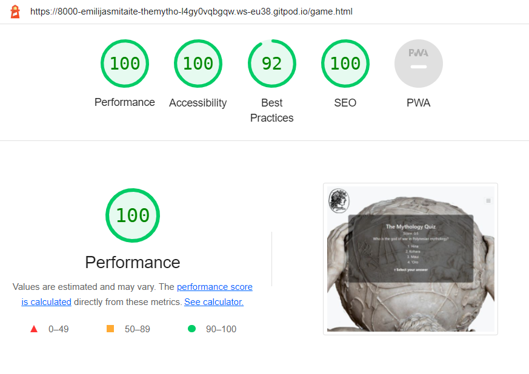 
* Lighthouse report for mobile 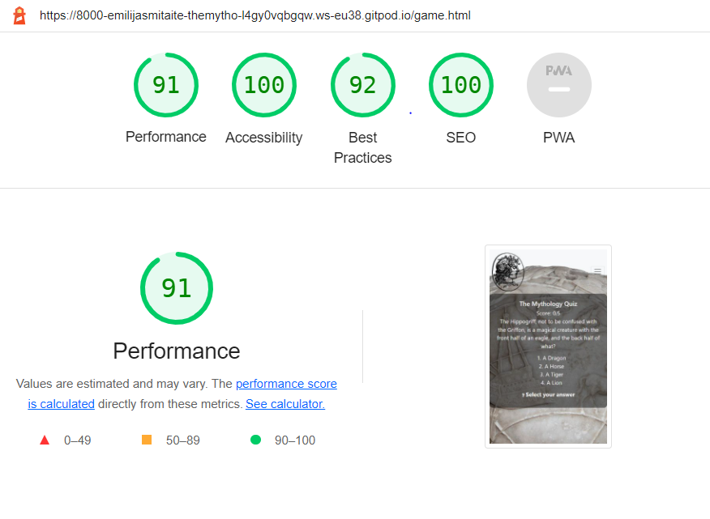
 - Addition of the meta description tag made a significant improvement to the score.
 - Another issue was with navbar links having no href attribute since I have used Bootstrap classes to add modal functionality to the navbar. This was solved by leaving empty href tags in the navbar.

### JShint was used to check if JavaScript source code complies with coding rules.
* JShint report for game.js Report shows undefined variable questionsAsked. It is, however, defined using commas (images below).  
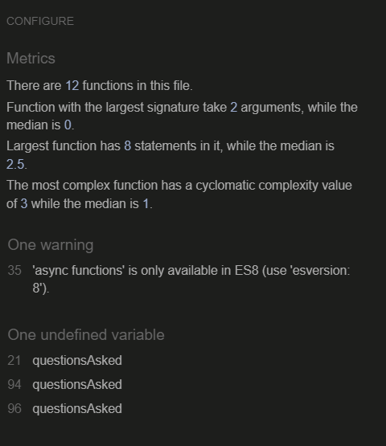
* Screenshot from game.js  
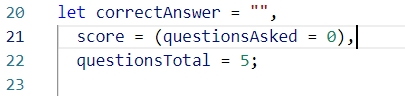
* JShint report for sendEmail.js   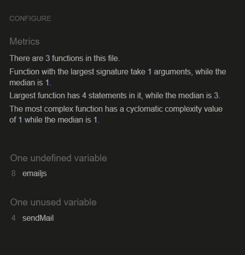

### Chrome developer tools 
* Used to test responsiveness and functionality on various devices.

## Functionality testing
* All the internal links are working.

### Navbar
1. Home link on hover has an animated shaking effect.
 - Animation occurs when hovered.
2. Help and Contact links are well-functioning modals.
  - Modal can be closed either by the Close button inside it or by clicking anywhere outside the modal. 
3. Contact form is a fully functioning email delivery form.
 - Email gets delivered.
 - A message appears "Form submitted successfully!".
 - Console logs status 200.
 - Empty or incorrect input is not allowed.

### Quiz game
1. Question and answer options are displayed.
- Question is loaded from the external API.
- Answer options are loaded and displayed in an ordered list. 
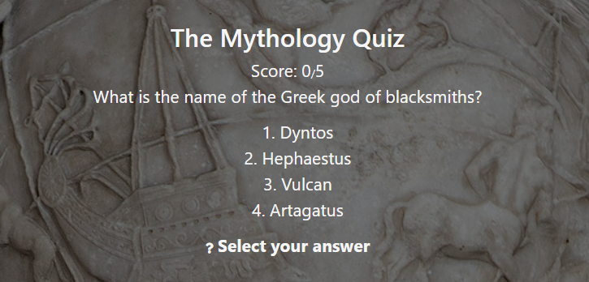
2. On clicking one of the options, check the answer, give feedback display the next question.
- In the case of the correct answer, the feedback message "Correct!" is displayed and the next answer is shown.
- In case of an incorrect answer, the feedback message "Incorrect!" is displayed, the correct answer shown briefly, next answer shown.
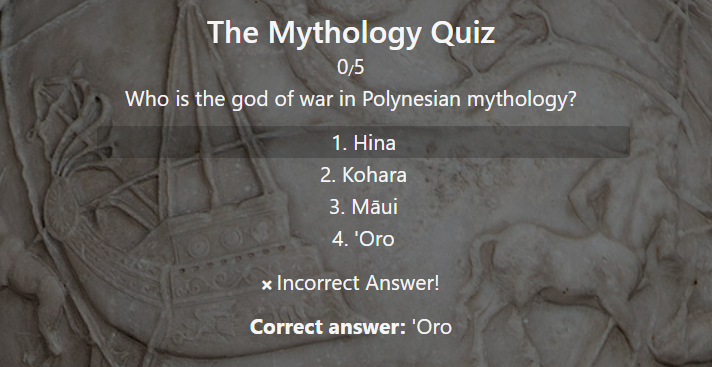
3. Score is updating while playing.
- Score is updating accordingly for correct/incorrect answers.
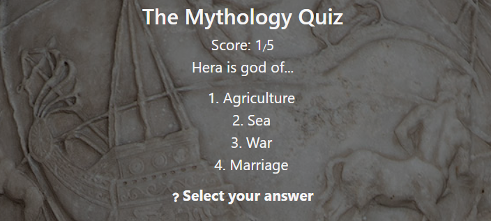
4. Give feedback on finishing the quiz.
- "Well done on finishing the quiz!" is displayed once the last question is answered.
- Total score is displayed.
- PLAY AGAIN Button is displayed, once clicked, the game restarts.
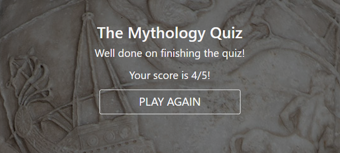

## Further testing
* Website was given to friends and family to test on various devices. Good responsiveness and functionality were reported.

## Bugs
* After answering all the questions, if the user didn't click the PLAY AGAIN button and kept clicking on answers, the score count would continue to add up even past the maximum number of questions given. I have tried removing the event listener but was best solved by setting question, answer and score counter display to none, then the PLAY AGAIN button was shown delayed 600ms. Congratulations message added too. These changes fixed the bug and improved the UX.

* Index.html validator returned an error saying that anchor tag cannot be inside button element. Solved by removing the button and adding Bootstrap class to the anchor tag.

* Adding function to PLAY AGAIN button. I have tried .click() but it wouldn't work on the anchor tag element, then I have tried to simulate click action with a separate function. The best solution was adding onclick="location.reload();" attribute directly to the button's HTML.

# Deployment
## GitHub Pages
The project was deployed to GitHub Pages using the following steps...
1. Log in to GitHub and locate the [GitHub Repository](https://github.com/emilija-smitaite/the-mythology-quiz)
2. At the top of the Repository (not the top of the page), locate the "Settings" button on the menu.
3. Scroll down the Settings page until you locate the "GitHub Pages" Section.
4. Under "Source", click the dropdown called "None" and select "Main".
5. The page will automatically refresh.
6. Scroll back down through the page to locate the now published site link in the "GitHub Pages" section.

## Forking the GitHub Repository
By forking the GitHub Repository we make a copy of the original repository on our GitHub account to view and/or make changes without affecting the original repository by using the following steps...
1. Log in to GitHub and locate the [GitHub Repository](https://github.com/emilija-smitaite/the-mythology-quiz)
2. At the top of the Repository (not top of page) just above the "Settings" button on the menu, locate the "Fork" button.
3. You should now have a copy of the original repository in your GitHub account.

## Making a Local Clone
1. Log in to GitHub and locate the [GitHub Repository](https://github.com/emilija-smitaite/the-mythology-quiz)
2. Under the repository name, click "Clone or download".
3. To clone the repository using HTTPS, under "Clone with HTTPS", copy the link.
4. Open Git Bash
5. Change the current working directory to the location where you want the cloned directory to be made.
6. Type "git clone" and then paste the URL you copied in Step 3.
7. Press Enter. Your local clone will be created.

# Credits
## Content
* All content was written by the developer. Any code that was not written by the developer was referenced in a document.

## Media 
* [Background image](https://www.hiclipart.com/free-transparent-background-png-clipart-bbczb/download) Image is freely available to download.
* [Home icon] (https://imgbin.com/png/RBf9Q0JR/medusa-greek-mythology-png) Image is freely available to download.

## Acknowledgements
* My mentors Spencer Barriball and Adegbenga Adeye for encouragement and support.

